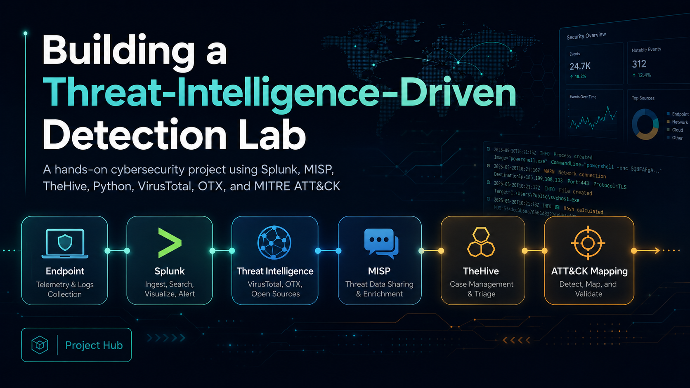
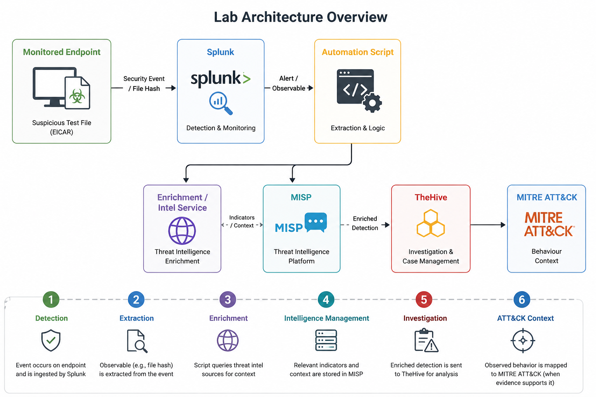
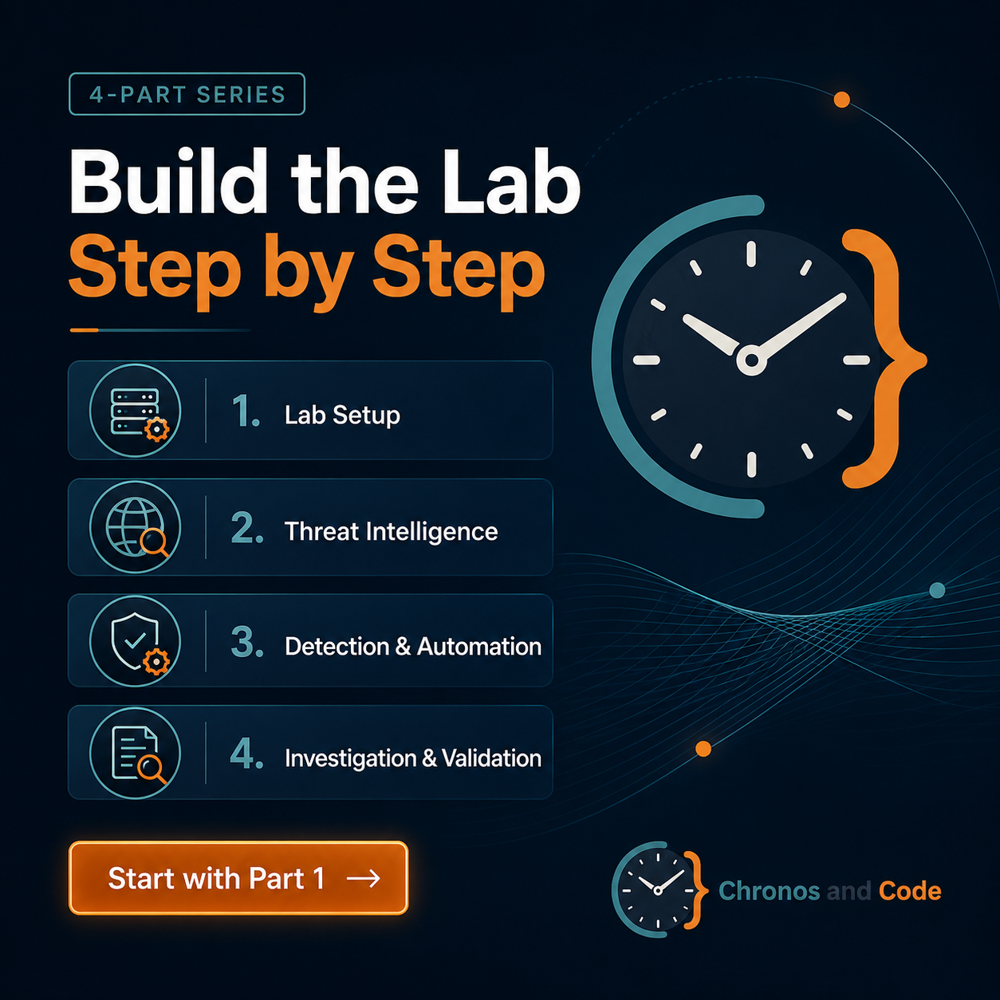
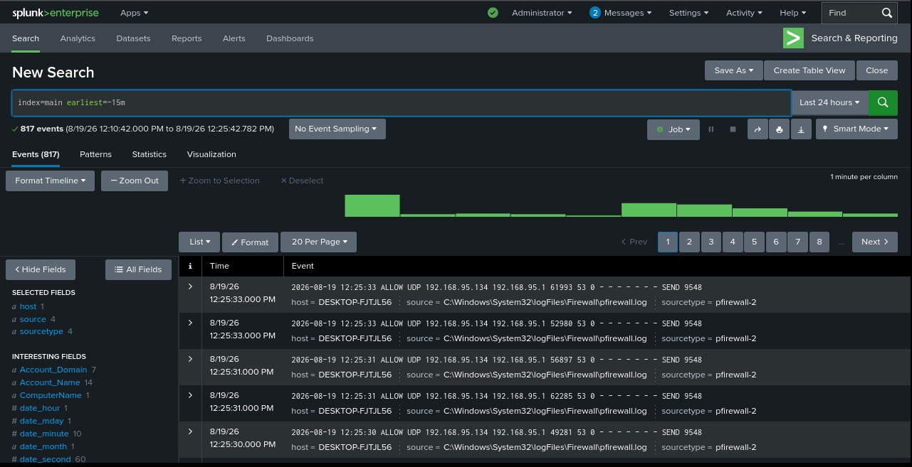
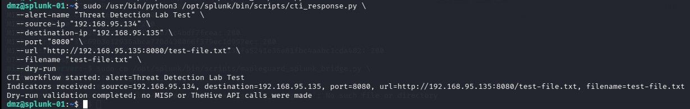
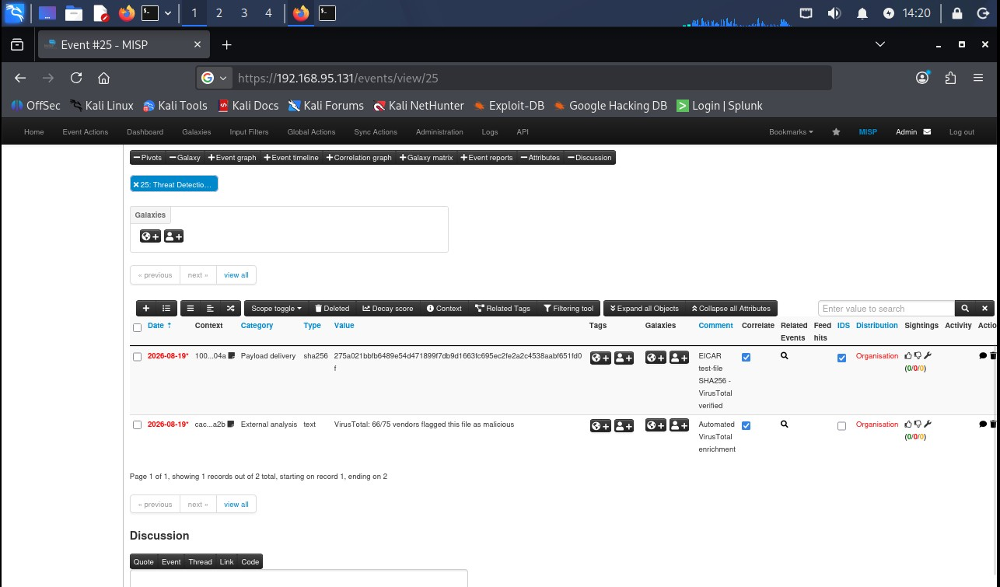
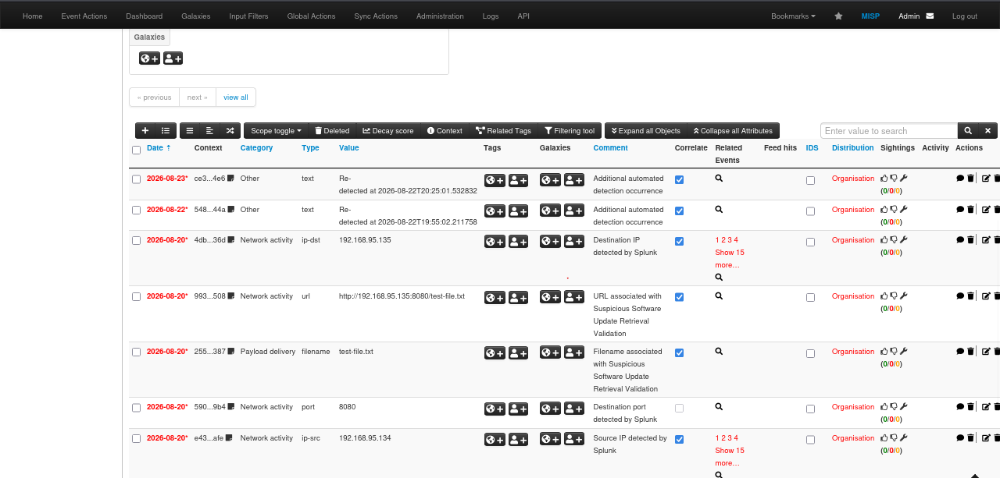
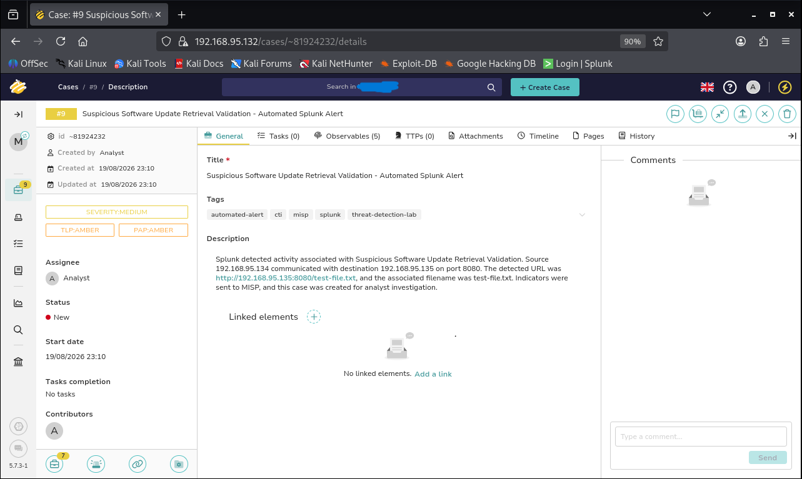

# Threat-Intelligence-Driven Detection Lab

A hands-on cybersecurity project demonstrating an end-to-end workflow for **detection, threat-intelligence enrichment, automation, investigation, and MITRE ATT&CK mapping**.

The lab integrates **Splunk, MISP, TheHive, Python, AlienVault OTX, VirusTotal, and MITRE ATT&CK** to explore what happens after a SIEM detects suspicious activity.

---

## Architecture


```text
Endpoint
   ↓
Splunk
   ↓
Python Automation
   ↓
Threat Intelligence / MISP
   ↓
TheHive
   ↓
MITRE ATT&CK
```

### Detection Workflow

```text
Suspicious File
      ↓
SIEM Alert
      ↓
File Hash Extraction
      ↓
Threat Intelligence Enrichment
      ↓
Threat Decision
      ↓
Case Creation
      ↓
MITRE ATT&CK Mapping
```

---

## Technologies

- Splunk
- MISP
- TheHive
- Python
- AlienVault OTX
- VirusTotal
- MITRE ATT&CK
- Windows Endpoint
- Ubuntu Server
- VMware

---

## Project Overview

The goal of this project is to build a practical security-monitoring workflow that connects detection with threat intelligence and investigation.

Instead of stopping when a SIEM generates an alert, the workflow continues by extracting relevant indicators, enriching them using threat-intelligence sources, managing indicators through MISP, creating an investigation case in TheHive, and mapping observed behaviour to MITRE ATT&CK.

The result is a complete workflow showing how multiple defensive-security tools can work together inside an isolated lab environment.

---

## Project Series


### Part 1 — Lab Setup, Environment, MISP & Splunk

Build the isolated lab environment, configure the systems, deploy MISP and Splunk, and begin collecting endpoint telemetry.

**[Read Part 1 →](https://chronosandcode.com/threat-intelligence-detection-lab-part-1/)**

---

### Part 2 — Threat Intelligence with MISP, OTX & VirusTotal

Integrate MISP with external threat-intelligence sources and enrich indicators using AlienVault OTX and VirusTotal.

**[Read Part 2 →](https://chronosandcode.com/threat-intelligence-detection-lab-part-2/)**

---

### Part 3 — Splunk Detection & Automated Response

Create Splunk detections and connect them to a Python-based automation workflow for indicator extraction, enrichment, and response processing.

**[Read Part 3 →](https://chronosandcode.com/threat-intelligence-detection-lab-part-3/)**

---

### Part 4 — TheHive, MITRE ATT&CK & End-to-End Validation

Create investigation cases in TheHive, map observed behaviour to MITRE ATT&CK, and validate the complete detection pipeline from beginning to end.

**[Read Part 4 →](https://chronosandcode.com/threat-intelligence-detection-lab-part-4/)**

---

## Full Project Documentation

The complete implementation guide includes:

- Lab architecture
- Environment configuration
- Screenshots
- Splunk configuration
- MISP configuration
- Threat-intelligence enrichment
- Python automation
- TheHive investigation workflow
- MITRE ATT&CK mapping
- Testing and validation
- Troubleshooting
- Limitations
- Future improvements

### [Explore the Full Project on Chronos & Code →](https://chronosandcode.com/building-a-threat-intelligence-driven-detection-lab/)

---

## What This Project Demonstrates

- Building an isolated cybersecurity lab
- Endpoint telemetry collection
- Centralized log ingestion
- SIEM detection and alerting
- File-hash extraction
- Threat-intelligence enrichment
- MISP indicator management
- AlienVault OTX integration
- VirusTotal enrichment
- Python-based security automation
- Automated processing of Splunk alert results
- TheHive case creation
- Investigation workflow development
- MITRE ATT&CK mapping
- End-to-end detection pipeline validation

---

---

## Code & Automation

The repository includes sanitized versions of the automation components used in the lab.

### Splunk → CTI Bridge

[`cti_splunk_bridge.py`](scripts/cti_splunk_bridge.py)

Reads Splunk alert results, validates the required fields, and passes the extracted observables to the CTI response workflow.

### CTI Response Workflow

[`cti_response.py`](scripts/cti_response.py)

Processes alert context, creates or updates MISP events, adds relevant observables, and creates an investigation case in TheHive.

### OTX → MISP Integration

[`otx_to_misp.py`](scripts/otx_to_misp.py)

Retrieves subscribed AlienVault OTX threat-intelligence indicators and imports supported indicators into MISP.

### VirusTotal Enrichment

[`vt_enrich_public.py`](scripts/vt_enrich_public.py)

Performs VirusTotal file-hash enrichment and adds the resulting context to a MISP event using a safe validation artifact.

### Script Documentation

See the complete script documentation:

[`scripts/README.md`](scripts/README.md)

> API keys, passwords, tokens, and other credentials are intentionally excluded from this repository.

---
---

## Project Evidence

### Splunk Endpoint Telemetry

Windows endpoint telemetry is successfully forwarded to Splunk and searchable within the SIEM.



---

### Python CTI Automation Workflow

The response script receives alert context from Splunk, extracts relevant observables, and prepares them for threat-intelligence processing.



---

### Threat Intelligence Enrichment in MISP

Extracted indicators are enriched with external threat-intelligence context, including VirusTotal results, and stored within MISP.



---

### Automated Observable Management

The workflow stores relevant observables such as source IP, destination IP, port, URL, and filename in MISP for correlation and investigation.



---

### TheHive Investigation Case

Enriched detection context is transferred into TheHive, where an investigation case is created for analyst review.



---

## Detection and Investigation Flow

The workflow begins when suspicious activity is detected on the monitored endpoint.

Splunk receives endpoint telemetry and evaluates the data using detection logic.

When the detection condition is met, alert results are passed to the automation workflow.

The automation extracts relevant indicators such as file hashes and uses threat-intelligence sources to gather additional context.

MISP is used to manage and enrich threat-intelligence information.

When the available evidence requires further investigation, a case can be created in TheHive.

The observed behaviour can then be mapped to relevant MITRE ATT&CK techniques based on the available evidence.

---

## MITRE ATT&CK

The project includes analyst-driven ATT&CK mapping based on observed behaviour and supporting evidence.

One demonstrated technique is:

**T1105 — Ingress Tool Transfer**

**Tactic:** Command and Control — `TA0011`

ATT&CK techniques are mapped only when the available evidence supports the behaviour being represented.

---

## Lab Environment

The project uses multiple isolated virtual machines representing different parts of the detection and investigation workflow.

```text
MISP
TheHive
Splunk
Windows Endpoint
Kali Linux
```

The environment is separated from normal production systems and is intended only for controlled cybersecurity testing and learning.

---

## Repository Structure

The repository will contain selected technical artifacts from the project.

```text
threat-intelligence-detection-lab/
│
├── README.md
├── docs/
│   ├── images/
│   └── screenshots/
│
├── scripts/
│
├── splunk/
│
└── .gitignore
```

Additional sanitized project files will be added progressively.

---

## Security and Safety

This project was created in an **isolated lab environment** for educational and defensive-security purposes.

Testing uses controlled and safe artifacts rather than real malware.

Sensitive information is intentionally excluded from this repository, including:

- API keys
- Passwords
- Authentication tokens
- Session cookies
- Private keys
- Secret configuration files
- Other credentials

Any example credentials or configuration values published in this repository should be treated as placeholders only.

---

## Limitations

The current implementation is designed as a controlled lab demonstration rather than a production security platform.

Current limitations include:

- Limited endpoint telemetry compared with a full EDR deployment
- Manual analyst involvement in some investigation decisions
- Manual MITRE ATT&CK mapping
- Limited detection scenarios
- Lab-scale infrastructure
- Basic error handling in some automation components

---

## Future Improvements

Potential improvements include:

- Adding Sysmon telemetry
- Expanding Splunk detection scenarios
- Improving automation error handling
- Stronger case deduplication
- Additional threat-intelligence enrichment
- More structured observables in TheHive
- Additional MITRE ATT&CK-aligned detections
- Improved logging and monitoring of automation components
- Expanded end-to-end testing scenarios

---

## Documentation

The full four-part technical guide is published on **Chronos & Code**:

**[Building a Threat-Intelligence-Driven Detection Lab](https://chronosandcode.com/building-a-threat-intelligence-driven-detection-lab/)**

---

## Disclaimer

This repository is intended for **educational, research, and defensive-security purposes only**.

All testing should be performed only on systems and environments that you own or have explicit authorization to test.
